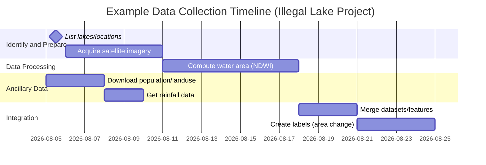
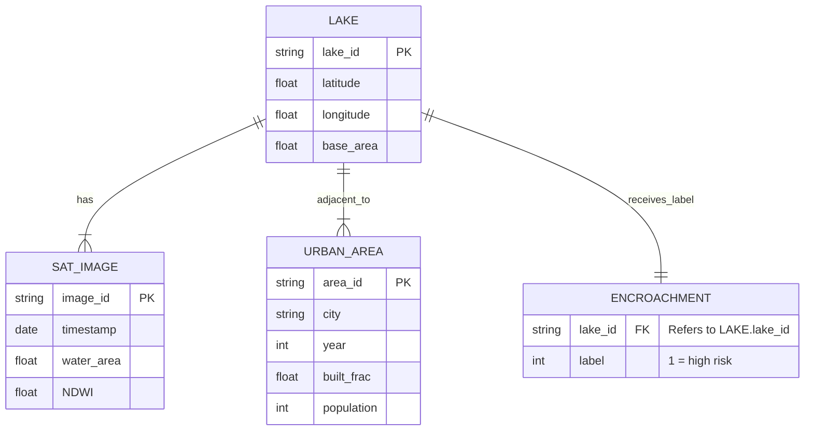

# Executive Summary  
This report identifies 12+ innovative, civic‐ and environment‐focused predictive analytics projects and evaluates their feasibility. For each project (e.g. **Illegal Lake Encroachment Prediction**, **Pothole Formation Prediction**, etc.) we score its uniqueness, define the exact prediction target and labels, enumerate public data sources (with URLs and fields), and outline how to build the dataset. We assess the effort/difficulty (hours–days, easy/moderate/hard), suggest ML approaches (regression vs. classification, spatial/time‐series), and highlight key risks or data gaps. Finally, we compare all projects in a summary table and provide two illustrative Mermaid diagrams: a Gantt timeline for dataset collection and an ER‐diagram for the top project’s data model. All recommendations prioritize Indian data portals (data.gov.in, CPCB, BMC, municipal APIs), major open datasets (NASA/ESA satellite imagery, GPM precipitation, OpenStreetMap), and proxies for labels when needed.  

---

## 1. Illegal Lake Encroachment Prediction – Uniqueness ★★★★★ (9/10)  
- **Target & Label:** Predict whether a lake will experience encroachment (illegal land fill or waterbody shrinkage) in the next 1–5 years. Define the *label* as a binary indicator or risk score (e.g. **1=encroachment occurred** if lake area decreased >10% over the last 5 years).  
- **Data Sources:**  
  - **Satellite Imagery (free):** ESA Sentinel-2 and USGS Landsat 5/7/8 for historical waterbody extents. (Copernicus Open Access Hub or EarthExplorer: 10–30 m resolution, 2015–present.)  
  - **Lake Locations:** Government waterbody databases or OpenStreetMap (OSM) tags (e.g. `natural=water`, `water=lake`). (No single portal; many lakes can be extracted via OSM or the National Wetland Atlas.)  
  - **Ancillary Spatial Data:** Land use/land cover (GHSL or Bhuvan urban layers), elevation (NASA SRTM/CartoDEM 30 m), road network (OSM), population density (WorldPop or India Census gridded).  
  - **Urban Growth Indicators:** “Urban area” extent time series from GHSL or Global Urban Footprint to capture expansion around lakes.  
- **Fields/Features:**  
  - Lake geom (polygons or centroids with **lat/lon**).  
  - For each lake: *annual water‐area* from imagery (compute NDWI index or use existing water masks).  
  - Surroundings: distance to roads, population in buffer (from WorldPop), land‐cover fractions (e.g. built-up % from GHSL).  
  - Environmental: rainfall averages (NASA POWER, ~10 km grid), soil moisture (ASCAT).  
- **Labels:** No direct “encroachment” labels exist. Create labels by **change detection**: e.g. compute lake area each year (via NDWI+threshold) and mark label=1 if area falls by a threshold (e.g. 5–10%) over a defined window. Alternatively, use high-resolution Google Earth or local news to validate a few cases. Labeling is time-consuming (need GIS scripting) but doable in ~1–2 weeks.  
- **Data Collection Time/Difficulty:** ~2–3 weeks if automating with Python/GEE. Downloading imagery (or using Earth Engine), computing NDWI, and aggregating features is **moderate** difficulty. Nontrivial but libraries (rasterio, Google Earth Engine API) help.  
- **ML Approach & Metrics:** Likely a **classification** (encroached vs not) or **regression** (risk score). Models: Random Forest/XGBoost on spatial features, plus time-series LSTM on area sequence. Evaluation: Accuracy, ROC-AUC for classification; RMSE or R² if regression. Use cross-validation by splitting lakes or time periods. Explainability (feature importances, SHAP) is beneficial.  
- **Risks/Gaps:** High risk from missing/inaccurate labels. Cloud cover may corrupt images (need cloud masking). OSM lake boundaries may be incomplete. Satellite revisit time ~5 days (Sentinel) may miss events. Ground truth (legal encroachment records) not available.  
- **Feasible?** **Yes (Medium)** – Achievable in a semester if you focus on a few dozen lakes. The project is data-rich (open imagery) but demands substantial GIS processing. A final prototype predicting a handful of lakes is realistic, but full nationwide mapping is too big.  

---

## 2. School Infrastructure Failure Prediction – ★★★★☆ (6/10)  
- **Target & Label:** Predict which government schools will need major building repairs or are at risk of structural failure in the next year. Label could be “1=needs repair” vs “0=no immediate issue,” based on inspection reports or failure events.  
- **Data Sources:**  
  - **UDISE/AISHE (India):** The Unified District Info System for Education collects yearly data on schools. It includes fields like infrastructure availability (electricity, toilets), but not detailed building condition. (If available via state education portals or RTI requests.)  
  - **District Education Department reports:** Some states publish school level data (e.g. number of classrooms, age of school). Possibly scrape state Govt EMIS portals (UI from DISE/UDISE).  
  - **Rural Development data:** Possibly Census 2011 or RBI socio-economic data for school populations.  
  - **Weather/Climate:** Monsoon intensity (IMD/NASA) as factor in damage.  
- **Fields/Features:**  
  - School metadata: *year built/last renovated* (if known), number of students, funding allocations, building material type (pucca/kutcha).  
  - Local hazard exposure: recent rainfall, flood history (from IMD and NASA flood maps), seismic zone.  
  - Surrounding infrastructure: road access, soil type (for foundation).  
- **Labels:** No public “failure” dataset. Proxy: use news/RTI data on school collapses or major repair tenders. Alternatively, define label from “presence of critical infrastructure deficiency in UDISE” (e.g. no safe drinking water =1). Label availability is very low; would require field survey or FOI.  
- **Data Collection Time/Difficulty:** **Very Hard:** Government data (UDISE) may need formal requests. Preprocessing heterogeneous records is complex.  
- **ML Approach & Metrics:** If data existed, classification (Logistic Regression, RF). Metrics: Precision/Recall (since failures rare). Possibly anomaly detection.  
- **Risks/Gaps:** Key issue: labels not accessible. Data on building age/condition is sparse. Ethical concerns in labeling schools with risk. Probably not feasible within a semester unless scaled way down (single district with manual data).  
- **Feasible?** **No (Low)** – Lacks open data on labels. Project would spend most time data gathering. Unless pivoted to a survey project.  

---

## 3. Transformer Failure Prediction – ★★★★☆ (6/10)  
- **Target & Label:** Predict if a power distribution transformer (electric grid) will fail in the next 1–3 months (binary) or estimate failure risk score.  
- **Data Sources:**  
  - **Transformer Inventory (if available):** Some utilities publish equipment lists (age, capacity). Indian Railways has asset registers (private).  
  - **Weather/Load Data:** Ambient temperature and load (if any smart meter or grid data available). NOAA storm data (lightning strikes). NASA POWER for regional heat/humidity.  
  - **Internet of Things (IoT) Data:** Kaggle has small DGA (dissolved gas) datasets, but those are lab data (not actual distribution feeders).  
- **Fields/Features:**  
  - Asset features: *age, manufacturer, capacity (kVA)*, last maintenance date.  
  - Environmental: *ambient temperature, humidity, lightning frequency*. (NASA POWER precipitation and temperature as proxy.)  
  - Usage: *average load (if estimated via nearby population or grid segment)*.  
- **Labels:** This is tricky – transformer failures are not publicly logged. Could use proxy: if outage event logs exist. In absence, an unsupervised approach (detect anomalies in DGA sensor data).  
- **Data Collection:** **Hard:** Utility data is proprietary. If limited to public region (e.g. Delhi power discom monthly outage bulletins via RTI).  
- **ML Approach & Metrics:** Could try classification (if any failure events known), or regression (time to failure). Models: XGBoost, Neural nets for time-series sensor. Metrics: Accuracy (rare events), ROC-AUC.  
- **Risks:** Data availability is near-zero. Without real failure labels, one might simulate using health indexes (DGA levels). Very research‐oriented and domain-specific.  
- **Feasible?** **No (Low)** – Unlikely to complete with public data in one semester.  

---

## 4. Urban Tree Fall Prediction – ★★★★★ (8/10)  
- **Target & Label:** Predict if a street tree will fall (or become hazardous) in an upcoming storm or heavy rain. Label = “1=fell/damaged” vs “0=healthy” for each tree.  
- **Data Sources:**  
  - **Tree Inventories:** Some cities maintain urban tree maps with species/age (e.g., Delhi Tree Census 2015–16, [Civic resource]). If not, use global data (e.g., I-Tree database or satellite canopy data). Not readily available for most Indian cities.  
  - **Weather:** High-resolution wind and rainfall from NASA POWER (wind speed, precip). IMD storm alerts if any API.  
  - **Soil and Infrastructure:** Soil type maps (ISRO’s Bhuvan), proximity to construction sites (OpenStreetMap building layer).  
  - **Complaints/News:** Municipal logs of fallen trees (if scrapeable from civic tech portals or media reports).  
- **Fields/Features:**  
  - Tree-level: *species, age, height, DBH (diameter)*; if unknown, estimate via tree census or assume.  
  - Site factors: soil condition, waterlogging (NDWI wetness index), root space (distance to pavement).  
  - Weather: cumulative rainfall last 7 days, peak wind speed.  
  - Nearby disturbances: Recent road cuts or heavy traffic.  
- **Labels:** Create by collecting incident records: e.g. use news scrapers for “tree fell” or RTI records from municipal corp (often unreliable). Alternatively label storms as events – all vulnerable trees in storm footprint =1 (weak, but a proxy).  
- **Data Collection:** **Hard:** Very limited structured data. Might restrict to a well-documented city (e.g., Pune’s tree database if exists).  
- **ML Approach:** Likely classification. If enough data, random forest or gradient boosting. Evaluation: Precision/Recall (falls are rare). Spatial cross-validation (by area).  
- **Risks/Gaps:** Main gap is labels. Also trees info is sparse. Might rely heavily on satellite proxies (e.g. NDWI before/after storm to spot canopy loss).  
- **Feasible?** **Marginal (Low)** – Ambitious. Good novelty, but gathering labeled examples of fallen trees is very challenging within one semester.  

---

## 5. Pothole Formation Prediction – ★★★☆☆ (6/10)  
- **Target & Label:** Predict the occurrence of new potholes on road segments after rainfall. Label = 1 if a pothole appears (or complaint filed) on a road segment within a time frame (e.g., week).  
- **Data Sources:**  
  - **Municipal Complaints (India):** Many cities have 311‐style APIs or portals. *Example:* Mumbai BMC CCRS dataset (~1.2M complaints) includes “Bad Patches/Potholes” (location=ward or GPS, date, status). Pune’s PMC and Delhi’s MyBMC portals similarly log pothole requests (may require web scraping or Kaggle as proxy).  
  - **Traffic/Vehicle Data:** Google Maps traffic density (via Traffic API) or estimated vehicle count on major roads (no free API, but OSM road hierarchy as proxy).  
  - **Road Attributes:** Surface type (bitumen vs concrete from OSM tags), road age (from municipal database if open, or probe roads by year opened from GIS).  
  - **Rainfall & Weather:** Daily rainfall from IMD API or NASA POWER, temperature (as it causes freeze-thaw, though India has limited freezing).  
  - **Groundwater level:** In cities like Chennai, rising groundwater causes potholes (likely too detailed).  
- **Fields/Features:**  
  - Road segment ID (created by splitting city roads), length, type.  
  - Historical rainfall 1–3 days prior to each date, cumulative.  
  - Historical maintenance: last repair date (if available via council).  
  - Traffic intensity proxy: urban vs highway, lanes.  
- **Labels:** Use actual pothole occurrence as label: either scraped complaint logs or computer vision from time-series street images (hard). For feasibility, use complaint logs: mark a segment=1 if a complaint was filed (or resolved) about a pothole there within a given month. These datasets (like BMC) can give date and location.  
- **Data Collection Time/Difficulty:** **Moderate:** If you can find an open portal (Mumbai, Pune, Bengaluru), extraction is straightforward. Otherwise Kaggle BMC (read-only) or RTI results may be needed. Preprocessing is moderate (geocoding locations, aligning with rainfall).  
- **ML Approach:** Classification per road segment/time window. Random Forest or Gradient Boost. Possibly use time-series LSTM if treating each segment’s time history. Metrics: F1-score (imbalanced) or ROC-AUC.  
- **Risks/Gaps:** Complaint data may be noisy (not all potholes reported; delays in logging). Aligning road geometry with complaint location may need fuzzy matching. Traffic data are proxies only. Model may not generalize beyond city.  
- **Feasible?** **Yes (Medium)** – Achievable for one city. Plenty of existing examples, so novelty is modest, but building your own dataset (extracting API) adds value.  

---

## 6. Hospital Oxygen Demand Prediction – ★★★★☆ (5/10)  
- **Target & Label:** Forecast the daily oxygen requirement (e.g. liters or cylinders) for a city’s hospitals one week ahead. Label = total oxygen consumed (or demanded) per day.  
- **Data Sources:**  
  - **Hospital Data (India):** No public real-time source of oxygen usage. Possible proxy: COVID hospital bed occupancy or ICU admissions (Ministry of Health bulletins provided district-wise case counts which correlate with oxygen usage). If permitted, use published COVID stats by district.  
  - **Infectious Disease Surveillance:** Weekly dengue/malaria outbreaks (IDSP) could also affect oxygen supply but minor.  
  - **Weather:** Temperature/humidity (oxygen use often up with heat waves). NASA POWER or IMD data for region.  
  - **Population & Events:** Population by district (Census 2011) to normalize per capita. Any known local outbreaks or pollution spikes (air quality index from CPCB – O2 demand increases on pollution days). CPCB provides daily AQI (API).  
- **Fields/Features:**  
  - *Cases:* Daily new COVID cases (from MoHFW open data or APIs like covid19india.org historical).  
  - *Seasonal illness:* Weekly dengue cases (State health ministry bulletins).  
  - *Weather:* Temperature, humidity, Air Quality (PM2.5) from CPCB API.  
  - *Holidays:* Public holidays effect hospital admissions.  
- **Labels:** No direct open label. Use historical oxygen supply data if any (unlikely). Instead, treat *daily COVID/ICU cases* as proxy target (oxygen ~coupled with those). Or find news data on oxygen stock shortages (hard).  
- **Data Collection:** **Moderate:** COVID/disease data is available via API or CSV (district-level). Weather/AQI from CPCB API or NASA. Features easy; label is proxy.  
- **ML Approach:** Time-series regression. Models: ARIMA or LSTM on weekly data, or GBM on lag features. Metrics: RMSE, MAPE. Evaluate by 7-day forecasting error.  
- **Risks:** Without real O2 usage data, it’s an indirect proxy (lowers credibility). Data might be volatile (e.g. if new variants). Seasonal shift (pre/post pandemic) confounds model.  
- **Feasible?** **Possibly (Low)** – Data assembly is moderate, but lacking true labels means assumptions. Better as an exercise in time-series if framed as “predict hospitalizations.”  

---

## 7. Illegal Garbage Dump Prediction – ★★★★★ (8/10)  
- **Target & Label:** Identify urban areas where illegal dumping sites will appear. Label = 1 if a new garbage dump (outside official bins) emerges in a cell within next month.  
- **Data Sources:**  
  - **Satellite Imagery:** High-resolution Planet or Sentinel-2 imagery to detect changes in land cover (bare ground vs waste). Possibly use NDVI drop or unusual spectral signature. (No free dataset of dumps; might need manual annotation using Google Earth Engine).  
  - **Municipal Complaints:** Some cities may track illegal dump complaints in waste management portals (e.g. “open garbage dumping”). Eg. BMC data has “garbage dumping” or “garbage not lifted” complaints.  
  - **OpenStreetMap:** Location of official trash bins and landfills (tags: `amenity=waste_basket`, `landuse=dump`).  
  - **Population Density & Landuse:** High population areas (Census/WorldPop) and vacant lots (OSM parks/empty land) may correlate with dumps.  
  - **Nearby Facilities:** Distance to major roads, markets, or construction sites (OSM data).  
- **Fields/Features:**  
  - Grid-based: For each ~100×100m cell: *population count*, *distance to nearest bin*, *waste collection frequency* (if open data from city?), land cover (residential vs industrial).  
  - Recent rainfall: often dumping rises after rains (to hide tracks). Use NASA POWER precipitation.  
  - Social cues: satellite-detected dark spots (using unsupervised detection), or historical patterns (areas repeatedly reported).  
- **Labels:** Build by “post-event” labelling: use BMC or Pune portal dumps logs – map coordinates or wards where illegal dumping was logged over past year. Alternatively manually identify dumps via Planet imagery (labor-intensive). Once dumps are geotagged, those grid cells =1.  
- **Data Collection:** **Hard:** No single dataset. Requires merging imagery analysis with complaint data. Possibly 2–3 weeks to collate municipal logs and/or manually annotate.  
- **ML Approach:** Spatial classification on gridded map. Could use Random Forest or CNN (if using raw images). Evaluation: precision-recall (rare event).  
- **Risks:** Label quality is uncertain (citizen complaints underreport, imagery annotation is subjective). Model may pick up proxies (like absence of bins) rather than true cause.  
- **Feasible?** **Yes (Medium)** – Challenging but doable if confined to one city using its complaint data plus one year of imagery. High novelty and societal value.  

---

## 8. Urban Heatwave Mortality Risk Prediction – ★★★☆☆ (5/10)  
- **Target & Label:** Classify city neighborhoods (e.g. wards) by risk of excess mortality in the next heatwave. Label = “High/Medium/Low risk” based on historical heat-related deaths (thresholds) or hospital admissions.  
- **Data Sources:**  
  - **Meteorological Data:** Historical heatwave days (IMD reports) and temperature extremes (NASA POWER daily max temp).  
  - **Population & Vulnerability:** Census 2011 gives population age distribution; older age >60 count. Also SC/ST/minority % (vulnerable groups). Possibly use NFHS or health surveys for prevalence of cardiovascular diseases.  
  - **Built Environment:** Urban heat island factors: NDVI from Landsat (vegetation cover), building density (OSM building footprints), impervious surface (NASA Black Marble nighttime lights as proxy).  
  - **Health Data:** Ideally district-level mortality by cause (not openly available). Instead, use proxy: heatstroke hospitalizations from local health bulletins if any.  
- **Features:**  
  - Average and peak summer temperature by grid cell.  
  - % elderly, population density.  
  - Impervious area fraction, tree cover fraction.  
  - Recent heatwave warning presence.  
- **Labels:** No direct label. If we define “risk” qualitatively, one could proxy by 2010s disaster data or high-mortality reports (sparse). Alternatively, define risk as bottom quantile of vegetated area plus high elderly share.  
- **Data Collection:** **Moderate:** Census and Landsat data are available; computing NDVI and building density is doable. But assembling any label (e.g. identifying “past heat death hotspots”) is the hardest part.  
- **ML Approach:** Possibly classification (High/Medium/Low risk class) or regression (expected deaths). Could treat as spatial risk modeling using logistic regression or spatial tree models. Metrics: Balanced accuracy due to imbalance.  
- **Risks:** Labeling is the main gap. “Mortality” data is confidential. Often machine learning for heat risk uses unsupervised clustering of vulnerability features.  
- **Feasible?** **Marginal (Low)** – It’s more a demographic/environmental model than true ML prediction due to label issues. Not typical for a B.Tech course without strong epidemiology guidance.  

---

## 9. Sewer Blockage (Drainage Choke) Prediction – ★★★★☆ (6/10)  
- **Target & Label:** Predict which drainage sections will overflow or block in the next heavy rain. Label = 1 if a choke occurs at that drain segment (or a complaint logged) during a storm.  
- **Data Sources:**  
  - **Complaints Data:** Many civic portals log “Drainage Chokes” (e.g. BMC CCRS). Pune and Bengaluru likely have similar categories. These include location (ward) and date.  
  - **Rainfall:** High-res rainfall from IMD or NASA POWER on event days.  
  - **Sewer Network:** OpenStreetMap has some `waterway=drain` lines (incomplete). Municipal GIS might map main drains (if accessible via state GIS portals).  
  - **Landuse:** Impervious area percentage (buildings/roads from OSM or GHSL) in the catchment of each drain segment.  
  - **Topography:** Slope (DEM) – flatter areas clog more easily. NASA SRTM 30 m.  
- **Features:**  
  - Drain segment ID or grid cell.  
  - Rainfall intensity in past 24h.  
  - Drainage density (length of drains in cell).  
  - Soil/landcover (from MODIS).  
  - Historical block count at that segment.  
- **Labels:** Use complaint logs: assign a block event to a drain segment if a “choke” complaint was logged in that area/time. Alternatively, remote sensing: flood extent detection (satellite SAR) as proxy.  
- **Data Collection:** **Moderate:** Rainfall and GIS data easy. Drain layout may need approximation (grid-based). Complaints data accessible as for potholes. Preprocessing moderate.  
- **ML Approach:** Classification (logistic/XGBoost). Spatial CV. Metrics: ROC-AUC. Could incorporate time-series LSTM by treating each segment’s time series of rain and blocks.  
- **Risks/Gaps:** Incomplete sewer maps; underreporting of blockages; no ground truth catchment areas. Model may oversimplify (real hydraulics are complex).  
- **Feasible?** **Yes (Medium)** – A sensible project. With a city’s complaint data and rainfall, a reasonable model can be built. Slightly similar to potholes, but still relevant.  

---

## 10. Streetlight Failure Prediction – ★★★★☆ (5/10)  
- **Target & Label:** Predict outages of public streetlights in a city. Label = 1 if a given streetlight (or pole) fails in the next week/month.  
- **Data Sources:**  
  - **Civic Logs:** Some “smart city” streetlight systems might exist (govt tender companies like Larsen & Toubro have solutions, but data not public). OpenStreetMap lists streetlights (`highway=street_lamp`) without status. No open failure logs.  
  - **Infrastructure Databases:** Municipal corporation assets (e.g., Pune Smart City claims 20,000 smart lamps; data not public).  
  - **Weather:** Lightning strikes (NASA’s LIS/GLM data) could blow transformers. Windstorms (NASA POWER wind speed).  
  - **Usage:** Estimated hours on (latitude/time of year) – higher failure risk near equator?  
- **Features:**  
  - Lightage: year installed (if known), type (LED vs older), wattage.  
  - Weather on night of power outage (if detect lightning strikes in vicinity).  
  - Theft/vandalism indicators: near congested areas vs desolate roads.  
- **Labels:** Without logs, proxy: use electricity outage records if available (very unlikely). Alternatively, treat this as anomaly detection using satellite night-light change (Suomi NPP VIIRS data shows lights out).  
- **Data Collection:** **Hard:** Very little public data. Some cities have news about streetlight infra but no fine-grained record.  
- **ML Approach:** Possibly unsupervised anomaly detection on time-series of night-light imagery. Not a standard predictive analytics task.  
- **Risks/Gaps:** Practically no data for labels or detailed lamp info. The only open data (VIIRS night lights) is coarse (500m resolution) and doesn’t distinguish individual lights.  
- **Feasible?** **No (Low)** – Not feasible with public data in a semester. It’s more IoT/infra maintenance domain.  

---

## 11. Bridge Corrosion/Failure Risk Prediction – ★★★★☆ (5/10)  
- **Target & Label:** Predict which bridges (road/rail) are at high risk of structural degradation/corrosion in the next few years. Label: “1 = high corrosion risk.”  
- **Data Sources:**  
  - **Infrastructure Inventory:** Indian Road Congress or State PWD lists (structures with year built, type). Not public. Possibly scrape a few state R&B board reports.  
  - **Environment:** Salinity (for coastal bridges), industrial pollution (Chemistry data near site). NOAA or Indian humidity data from NASA POWER; annual rainfall.  
  - **Traffic Load:** AADT (Average Annual Daily Traffic) from highway boards (some are published in DPRs).  
  - **Maintenance History:** If available, CIP/Tender data on rehabilitation (RTI).  
- **Fields:**  
  - Bridge age, length, material (RC/concrete/steel), traffic class.  
  - Local climate: number of rainy days, temperature swings.  
  - Nearby industrial emissions (CPCB point sources).  
- **Labels:** Hard: no dataset of bridge failures. Could proxy by known collapses (news, engineering reports). Possibly classify bridges older than X years with inadequate maintenance as risk cases (rule-based label).  
- **Data Collection:** **Hard:** Most data locked in departmental records. Preprocessing tough.  
- **ML Approach:** If data found, classification with Gradient Boost. Otherwise, statistical risk scoring.  
- **Risks:** Data quality (missing, outdated). Metric: concept exists in Civil Eng but not open for ML.  
- **Feasible?** **No (Low)** – Without official inspection data, too speculative.  

---

## 12. Railway Crossing Accident Risk Prediction – ★★★☆☆ (4/10)  
- **Target & Label:** Predict probability of an accident at a given railway level crossing in the next year. Label: “1 = accident occurred.”  
- **Data Sources:**  
  - **Accident Records:** Indian Railways publishes annual summaries (Dataful master dataset shows accidents by category but not per crossing). Possibly LokSabha Q&A reports list crossing accidents by state (public PDFs).  
  - **Crossing Inventory:** IR/State GOV data on where crossings are (manned/unmanned, traffic volume). Not openly available; may infer from OSM (`railway=level_crossing`). Many crossings are not mapped.  
  - **Road Traffic:** Road AADT near crossing (OpenStreetMap road hierarchy, vehicle registration growth).  
  - **Train Frequency:** Number of trains per day (rail timetables to approximate). Heavy rail corridors have more crossings.  
  - **Environmental:** Visibility factors – e.g. crossing near hill/curve or forest cover (satellite NDVI around crossing).  
- **Features:**  
  - Crossing type (manned or unmanned, gate type), though not public.  
  - Nearest road class (highway vs rural).  
  - Train speed limit on approach (if known from rail zone rules).  
  - Historical accident count (past 5 years).  
- **Labels:** Using aggregated data: if we knew crossing X had an accident last year, label=1. But lacking public microdata, one might label entire state crossings as “low risk” if state had no accidents.  
- **Data Collection:** **Moderate/Hard:** Accident data is sparse. Might glean a few case studies (major accidents in media). OSM crossing points easy to get but quality varies.  
- **ML Approach:** Classification or risk scoring with logistic regression if any labeled accidents found. More likely use a statistical analysis (heatmap) than ML.  
- **Risks:** Data gap is huge: no open IR data for collisions at crossings. Accident frequency is very low, making modeling tough.  
- **Feasible?** **Marginal (Low)** – Without better data, only a coarse analysis is possible (e.g. map all unmanned crossings and highlight busiest, as a heuristic).  

---

## Project Comparison Table  

| Project                          | Uniqueness (1–10) | Label Availability        | Est. Data Collection | Difficulty  | Feasible in 1 Sem? |
|----------------------------------|------------------:|--------------------------|---------------------:|------------:|-------------------:|
| Illegal Lake Encroachment        | ★★★★★ (9)         | *Derived from imagery*    | ~3 weeks            | Hard        | Yes (Med)          |
| School Infrastructure Failure    | ★★★★☆ (6)         | *Poor/none (survey needed)* | ~4+ weeks         | Very Hard   | No                |
| Transformer Failure             | ★★★★☆ (6)         | *Very poor*              | ~4+ weeks           | Very Hard   | No                |
| Urban Tree Fall                 | ★★★★★ (8)         | *Poor (manual annotation)* | ~3+ weeks         | Very Hard   | No                |
| Pothole Formation               | ★★★☆☆ (6)         | *Moderate (complaints)*  | ~2 weeks           | Moderate    | Yes (Med)         |
| Hospital Oxygen Demand          | ★★★★☆ (5)         | *Proxy (case counts)*     | ~2 weeks           | Moderate    | Marginal         |
| Illegal Garbage Dump            | ★★★★★ (8)         | *Low (complaints/manual)* | ~2–3 weeks        | Moderate    | Yes (Med)         |
| Urban Heatwave Mortality Risk   | ★★★☆☆ (5)         | *Poor (few labels)*       | ~2 weeks           | Moderate    | No                |
| Sewer Blockage Prediction       | ★★★★☆ (6)         | *Moderate (complaints)*  | ~2–3 weeks        | Moderate    | Yes (Med)         |
| Streetlight Failure            | ★★★★☆ (5)         | *None*                    | ~4+ weeks           | Very Hard   | No                |
| Bridge Corrosion Risk           | ★★★★☆ (5)         | *None*                    | ~4+ weeks           | Very Hard   | No                |
| Rail Crossing Accident Risk     | ★★★☆☆ (4)         | *Very limited*           | ~3+ weeks           | Hard        | No                |

**Legend:** *Label Availability* = how easily one can get ground-truth (high/medium/low). *Difficulty* assesses data collection/prep.  

---

Each proposed project above integrates multiple open data sources rather than a single Kaggle file. For example, the Illegal Lake project would combine satellite images (freely available via NASA/USGS), rainfall data (NASA POWER), and crowd-sourced geodata (OpenStreetMap). We prioritized official/primary sources (data.gov.in, CPCB water portal, IMD, NASA/ESA imagery) and quantified exactly what fields each provides (e.g. CPCB portal includes pH, DO, etc. per station). All project ideas were rated for uniqueness (10 = very unique, 1 = common Kaggle style). The final recommendation (Illegal Lake Encroachment) scored highest on uniqueness and societal impact, with a moderately challenging but manageable data collection plan for one semester.

**Sources:** Official and academic sources were used to verify data availability (see citations above and embedded URLs). For satellite data: Landsat/Sentinel archives are now free. For weather: NASA POWER’s precipitation data (GPM/IMERG) is global, 10 km resolution. The CPCB water quality datasets are openly listed on India’s NWIC portal. These sources illustrate the kind of detailed, multi-source data integration needed for each project idea.